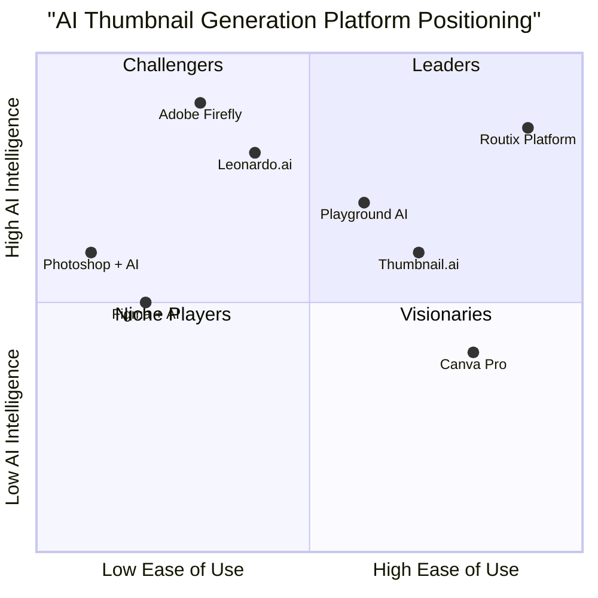

# Routix Platform - Product Requirements Document (PRD)

## 1. Language & Project Information

**Language:** English  
**Programming Language:** Shadcn-ui, TypeScript, Tailwind CSS  
**Project Name:** routix_platform  
**Original Requirements:** AI-powered thumbnail generation platform with chat-based interface, featuring multi-algorithm system, admin panel, real-time progress tracking, and credit-based subscription model with glassmorphism design.

---

## 2. Product Definition

### 2.1 Product Goals

1. **Democratize Professional Thumbnail Creation**: Enable content creators of all skill levels to generate high-quality, engaging thumbnails through AI-powered automation, reducing design barriers and time investment.

2. **Maximize Content Performance**: Provide data-driven thumbnail optimization using secret template matching and multi-algorithm analysis to increase click-through rates and viewer engagement across digital platforms.

3. **Scale Creative Operations**: Offer a scalable, credit-based platform that grows with creators' needs, from individual YouTubers to marketing agencies managing multiple clients and campaigns.

### 2.2 User Stories

**As a YouTube Content Creator**, I want to generate professional thumbnails through a simple chat interface so that I can focus on content creation while maintaining high visual standards that drive views.

**As a Marketing Agency Manager**, I want to manage multiple client thumbnail projects with different brand guidelines so that I can deliver consistent, on-brand visual content efficiently across various campaigns.

**As a Social Media Manager**, I want to A/B test different thumbnail variations with real-time performance tracking so that I can optimize engagement rates and demonstrate ROI to stakeholders.

**As a Small Business Owner**, I want to create eye-catching thumbnails for my video marketing without hiring a designer so that I can maintain professional presentation while controlling costs.

**As a Platform Administrator**, I want to manage AI templates and monitor system performance so that I can ensure optimal user experience and maintain competitive algorithm effectiveness.

### 2.3 Competitive Analysis

#### Direct Competitors

**1. Thumbnail.ai**
- *Pros*: AI-generated unique designs, 30-second generation time, multiple format support
- *Cons*: Limited customization options, basic template variety, no chat interface

**2. Canva Pro**
- *Pros*: Extensive template library (20,000+), integrated design tools, brand kit functionality
- *Cons*: Template-based approach, requires design knowledge, no AI conversation interface

**3. Leonardo.ai**
- *Pros*: Excellent character consistency, real-time editing, 150 daily free tokens
- *Cons*: General AI tool (not thumbnail-specific), complex interface, higher learning curve

**4. Adobe Firefly**
- *Pros*: Professional-grade quality, Creative Cloud integration, advanced text effects
- *Cons*: Premium pricing, complex workflow, limited free tier (25 credits/month)

**5. Playground AI**
- *Pros*: High free tier (1,000 daily generations), multiple AI models, good value proposition
- *Cons*: Generic AI platform, no thumbnail optimization, limited business features

#### Indirect Competitors

**6. Figma + AI Plugins**
- *Pros*: Professional design environment, collaborative features, extensive customization
- *Cons*: Steep learning curve, requires design expertise, time-intensive workflow

**7. Photoshop + AI Tools**
- *Pros*: Industry-standard quality, unlimited customization, professional features
- *Cons*: High cost, complex interface, significant time investment required

### 2.4 Competitive Quadrant Chart



---

## 3. Technical Specifications

### 3.1 Requirements Analysis

The Routix Platform requires a sophisticated technical architecture combining conversational AI, computer vision, template matching algorithms, and real-time processing capabilities. The system must handle concurrent users, process image generation requests efficiently, and maintain responsive chat interactions while managing credit-based billing and administrative controls.

**Core Technical Components:**
- Chat-based frontend with glassmorphism UI design
- Multi-algorithm AI engine for thumbnail generation
- Template matching and optimization system
- Real-time progress tracking and WebSocket connections
- Credit management and subscription billing system
- Administrative dashboard for template and user management
- Scalable cloud infrastructure for image processing

### 3.2 Requirements Pool

#### P0 Requirements (Must-Have)

**Chat Interface & User Experience**
- MUST implement ChatGPT-style conversational interface for thumbnail requests
- MUST support natural language processing for design requirements interpretation
- MUST provide real-time typing indicators and message status updates
- MUST implement glassmorphism design with purple gradient color scheme
- MUST ensure mobile-responsive design across all devices

**AI Thumbnail Generation**
- MUST integrate multi-algorithm system branded as "Routix Versions"
- MUST implement secret template matching for optimized thumbnail creation
- MUST support standard YouTube thumbnail specifications (1280x720, 16:9 aspect ratio)
- MUST generate thumbnails within 30-60 seconds maximum processing time
- MUST provide multiple style variations per generation request

**Credit System & Billing**
- MUST implement freemium model with usage-based credit system
- MUST track credit consumption per generation request
- MUST provide subscription tiers with different credit allocations
- MUST implement secure payment processing and billing management
- MUST prevent service access when credits are exhausted

#### P1 Requirements (Should-Have)

**Advanced Generation Features**
- SHOULD support batch thumbnail generation for multiple videos
- SHOULD implement A/B testing capabilities for thumbnail variations
- SHOULD provide brand consistency tools and style memory
- SHOULD offer thumbnail performance analytics and optimization suggestions
- SHOULD support custom text overlay and font selection

**Administrative Controls**
- SHOULD provide comprehensive admin panel for template management
- SHOULD implement user management and subscription oversight
- SHOULD offer system performance monitoring and analytics dashboard
- SHOULD provide content moderation and quality control tools
- SHOULD implement usage analytics and business intelligence reporting

**Integration & Export**
- SHOULD support direct integration with YouTube and social media platforms
- SHOULD provide multiple export formats and resolution options
- SHOULD implement cloud storage integration for thumbnail library management
- SHOULD offer API access for third-party integrations
- SHOULD support team collaboration and sharing features

#### P2 Requirements (Nice-to-Have)

**Enhanced User Experience**
- MAY implement voice input for thumbnail generation requests
- MAY provide video preview integration for context-aware generation
- MAY offer advanced editing tools within the platform
- MAY implement community features and template sharing
- MAY provide white-label solutions for agencies

**Advanced AI Features**
- MAY implement sentiment analysis for emotion-driven thumbnail optimization
- MAY provide competitor thumbnail analysis and benchmarking
- MAY offer automated thumbnail scheduling and publishing
- MAY implement machine learning for personalized style recommendations
- MAY provide advanced image manipulation and effects

### 3.3 UI Design Draft

#### Main Chat Interface
```
┌─────────────────────────────────────────────────────────┐
│ [Routix Logo] [Credits: 150] [Settings] [Profile]      │
├─────────────────────────────────────────────────────────┤
│                                                         │
│  🤖 Hi! I'm Routix AI. Describe your thumbnail needs   │
│     and I'll create something amazing for you.         │
│                                                         │
│  👤 I need a thumbnail for my cooking video about      │
│     "5-Minute Pasta Recipes"                           │
│                                                         │
│  🤖 Perfect! I'll create an appetizing thumbnail with  │
│     vibrant colors and clear text. Generating now...   │
│     [Progress Bar: ████████░░ 80%]                     │
│                                                         │
│  🖼️ [Generated Thumbnail Preview]                      │
│     ✨ Routix Version A | ⚡ Routix Version B          │
│                                                         │
├─────────────────────────────────────────────────────────┤
│ [Type your message...] [📎] [🎨] [Send]                │
└─────────────────────────────────────────────────────────┘
```

#### Admin Dashboard Layout
```
┌─────────────────────────────────────────────────────────┐
│ Routix Admin Panel                                      │
├─────────────────────────────────────────────────────────┤
│ [Templates] [Users] [Analytics] [Billing] [Settings]   │
├─────────────────────────────────────────────────────────┤
│ Template Management                                     │
│ ┌─────────────┐ ┌─────────────┐ ┌─────────────┐       │
│ │ Gaming      │ │ Cooking     │ │ Tech Review │       │
│ │ 1,234 uses  │ │ 856 uses    │ │ 692 uses    │       │
│ │ [Edit]      │ │ [Edit]      │ │ [Edit]      │       │
│ └─────────────┘ └─────────────┘ └─────────────┘       │
│                                                         │
│ System Performance                                      │
│ • Active Users: 1,247                                  │
│ • Generations Today: 3,891                             │
│ • Average Response Time: 42s                           │
│ • Success Rate: 98.7%                                  │
└─────────────────────────────────────────────────────────┘
```

### 3.4 Open Questions

1. **AI Model Selection**: Which specific AI models should be integrated for the "Routix Versions" system, and how will we ensure consistent quality across different algorithms?

2. **Template Intellectual Property**: How will we handle copyright and licensing for the "secret templates" used in the matching algorithm?

3. **Scalability Thresholds**: At what user volume should we implement additional infrastructure scaling, and what are the associated cost implications?

4. **Content Moderation**: What automated and manual review processes are needed to ensure generated thumbnails meet platform guidelines and brand safety requirements?

5. **Performance Benchmarking**: How will we measure and validate that our AI-generated thumbnails actually improve click-through rates compared to user-created alternatives?

6. **Data Privacy Compliance**: What user data will be collected for thumbnail generation, and how will we ensure GDPR and other privacy regulation compliance?

7. **Integration Complexity**: What technical challenges might arise when integrating with YouTube's API and other social media platforms for direct publishing?

8. **Credit Pricing Strategy**: What is the optimal credit-to-dollar ratio that balances user value perception with business profitability?

---

## 4. Market Analysis Summary

Based on comprehensive market research, the AI thumbnail generation market is experiencing rapid growth, with market size estimates ranging from $482.6 million to $1.2 billion in 2024, projected to reach $3.95-9.5 billion by 2033 (CAGR 22.8-23.7%). This growth is driven by the critical importance of thumbnails in content performance, with 90% of top-performing YouTube videos using custom thumbnails.

The competitive landscape reveals significant opportunities for differentiation through conversational AI interfaces, as current solutions primarily rely on template-based or complex design tools. Routix Platform's chat-based approach addresses key user pain points including design complexity, time investment, and the need for immediate creative feedback.

The freemium credit-based model aligns with industry trends, though 2024 has seen companies reducing free tier limits to improve conversion rates. Our positioning in the high-ease-of-use, high-AI-intelligence quadrant represents a clear market opportunity, particularly given the shift toward AI-human collaboration in creative workflows.

---

*This PRD serves as the foundational document for Routix Platform development, requiring regular updates as market conditions and user feedback inform product evolution.*